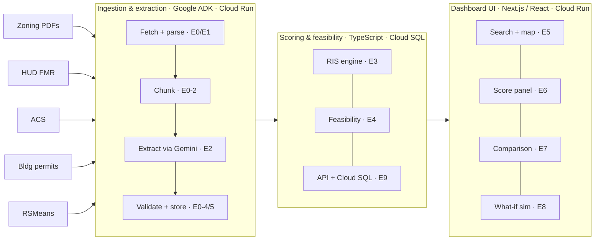

# Parcela — Architecture

## System Overview

## Layer Descriptions

### Data sources
Public datasets manually downloaded and stored in `data/raw/` before the pipeline is run. See [`docs/DATA_SOURCES.md`](DATA_SOURCES.md) for download URLs, formats, and field mappings.

### Ingestion & extraction pipeline (E0/E1/E2)
A batch pre-processing pipeline built with Google ADK for TypeScript and deployed to Cloud Run. Runs once per jurisdiction before the demo. Implemented as a `SequentialAgent` (fetch → chunk → extract → validate → store) with a nested `ParallelAgent` for the five LLM field extractions. See [`docs/adr/0002-google-adk-for-pipeline-orchestration.md`](adr/0002-google-adk-for-pipeline-orchestration.md).

### Scoring & feasibility engine (E3/E4/E9)
Deterministic TypeScript calculations served via Next.js API routes, backed by Cloud SQL (PostgreSQL). Computes the composite Regulatory Impact Score (RIS) and feasibility outputs (unit yield, buildable area, cost per unit) from structured pipeline outputs.

**RIS composite formula:** `RIS = 0.30×DCI + 0.25×DCOI + 0.20×PCI + 0.25×CRP`

| Sub-score | Weight | Rationale |
|-----------|--------|-----------|
| Density Constraint Index (DCI) | 30% | Density constraints (lot size, height, density limits) are the most direct regulatory barrier to housing supply — they set the hard ceiling on what can be built |
| Development Cost Impact (DCOI) | 25% | Cost impacts (parking minimums, regional construction costs) directly affect financial feasibility and are the most legible metric for policy makers |
| Comparative Restrictiveness Percentile (CRP) | 25% | Peer comparison provides the reference context that makes the score actionable — without it, an absolute score has no meaning |
| Permitting Complexity Indicator (PCI) | 20% | Permitting complexity matters but is partially captured by CRP and is harder to extract reliably from zoning text; weighted lower to reflect data confidence |

All sub-scores are normalized to 0–100 using min-max normalization against the peer jurisdiction set. Higher score = more restrictive regulatory environment.

### Dashboard UI (E5–E8)
Next.js / React frontend deployed to Cloud Run. Four functional areas: search + map, RIS score panel with inline AI disclosures, cross-jurisdiction comparison, and what-if policy simulation.

## Key Decisions

| Decision | Choice | Reference |
|----------|--------|-----------|
| Cloud platform | Google Cloud (Cloud Run, Cloud SQL, Vertex AI) | [ADR-0001](adr/0001-platform-and-stack.md) |
| Application stack | Next.js + TypeScript | [ADR-0001](adr/0001-platform-and-stack.md) |
| Pipeline orchestration | Google ADK for TypeScript | [ADR-0002](adr/0002-google-adk-for-pipeline-orchestration.md) |
| LLM | Gemini via Vertex AI | [ADR-0002](adr/0002-google-adk-for-pipeline-orchestration.md) |
| Pipeline execution | Batch pre-processing (not real-time) | [ADR-0002](adr/0002-google-adk-for-pipeline-orchestration.md) |
