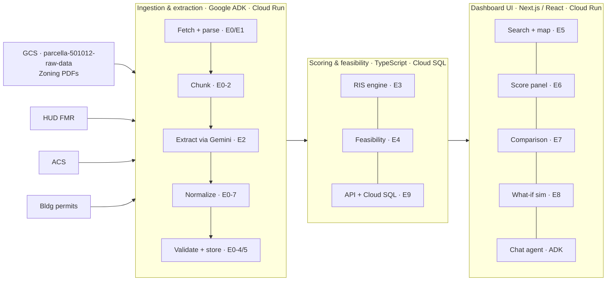

# Parcella — Architecture

## System Overview

## Layer Descriptions

### Data sources
Zoning ordinance PDFs are stored in GCS (`gs://parcella-501012-raw-data`) and fetched by the pipeline at runtime. Other public datasets (FMR, ACS, permits) are small CSVs downloaded via API. Infrastructure is managed with Terraform in `infra/`. See [`docs/DATA_SOURCES.md`](DATA_SOURCES.md) for download URLs, formats, and field mappings.

### Ingestion & extraction pipeline (E0/E1/E2)
A batch pre-processing pipeline in TypeScript deployed to Cloud Run. Runs once per jurisdiction before the demo via `npm run pipeline:run`. Implements the sequence: fetch PDF → parse text → chunk → extract fields via Gemini → normalize → validate → store.

**Key modules:**
- `lib/pipeline/runner.ts` — orchestrates the full sequence; injectable `PdfFetcher`, `PdfParser`, `FieldExtractor` interfaces
- `lib/pipeline/gcs-fetcher.ts` + `local-fetcher.ts` — GCS fetch (prod) or local `data/raw/` fallback (dev)
- `lib/pipeline/pdf-parser.ts` — PDF → text via `pdf-parse`
- `lib/pipeline/chunk.ts` — ≤4000 token overlapping chunks
- `lib/extractors/` — Gemini extractors using `@google-cloud/vertexai`:
  - Per-field extractors: lot size, height, density, parking, setbacks, discretionary review
  - `zone-discovery.extractor.ts` — discovers all relevant zoning districts in a jurisdiction
  - `multi-zone-gemini.extractor.ts` + `multi-zone-setbacks.extractor.ts` — extract fields per zone, then average for jurisdiction-level score
- `lib/pipeline/normalize.ts`, `validate.ts` — deterministic post-extraction conversion and plausibility checks

See [`docs/adr/0002-google-adk-for-pipeline-orchestration.md`](adr/0002-google-adk-for-pipeline-orchestration.md) for the original ADK decision rationale. The pipeline uses direct TypeScript orchestration; ADK is used for the chat agent (see below).

### Scoring & feasibility engine (E3/E4/E9)
Deterministic TypeScript calculations served via Next.js API routes, backed by Cloud SQL (PostgreSQL). Computes the composite Regulatory Impact Score (RIS) and feasibility outputs (unit yield, buildable area, cost per unit) from structured pipeline outputs.

**RIS composite formula:** `RIS = 0.30×DCI + 0.25×DCOI + 0.20×PCI + 0.25×CRP`

| Sub-score | Weight | Rationale |
|-----------|--------|-----------|
| Density Constraint Index (DCI) | 30% | Density constraints (lot size, height, density limits) are the most direct regulatory barrier to housing supply — they set the hard ceiling on what can be built |
| Development Cost Impact (DCOI) | 25% | Cost impacts (parking minimums, regional construction costs) directly affect financial feasibility and are the most legible metric for policy makers |
| Comparative Restrictiveness Percentile (CRP) | 25% | Peer comparison provides the reference context that makes the score actionable — without it, an absolute score has no meaning |
| Permitting Complexity Indicator (PCI) | 20% | Permitting complexity matters but is partially captured by CRP and is harder to extract reliably from zoning text; weighted lower to reflect data confidence |

All sub-scores are normalized to 0–100 using min-max normalization against the peer jurisdiction set. Higher score = more restrictive regulatory environment.

### Chat agent
An ADK `LlmAgent` (Gemini 2.5 Flash via Vertex AI) provides a conversational interface for policy questions. Users can ask free-form questions about zoning regulations, and the agent calls tools to retrieve data and generate grounded answers.

**Key modules:**
- `lib/chat/agent.ts` — LlmAgent definition with system instruction
- `lib/chat/tools.ts` — three `FunctionTool` declarations: `get_jurisdiction_data` (DB query), `get_pdf_text` (GCS PDF fetch + parse with caching), `compute_feasibility` (what-if calculations)
- `lib/chat/run.ts` — per-request orchestration via `InMemoryRunner.runEphemeral()`
- `app/api/jurisdictions/[id]/chat/route.ts` — stateless POST endpoint; conversation history maintained client-side

See [`docs/adr/0006-adk-chat-agent.md`](adr/0006-adk-chat-agent.md) for design rationale.

### PDF source citations
Extracted fields in the score panel link directly to the source page in the zoning ordinance PDF. The PDF is served via a proxy route (`app/api/jurisdictions/[id]/pdf/route.ts`) that fetches from GCS and streams to the browser, with page-level deep-linking using `source_page` from the extraction pipeline.

### Dashboard UI (E5–E8)
Next.js / React frontend deployed to Cloud Run. Five functional areas: search + map (with regional and national zoom levels), RIS score panel with inline AI disclosures, cross-jurisdiction comparison (with per-jurisdiction maps), what-if policy simulation, and a chat panel for policy questions.

### Explainability and responsible AI

The system surfaces several layers of transparency to support explainable, responsible AI:

| Feature | Where | Details |
|---------|-------|---------|
| Confidence badges | Score panel sub-score headers | High / Medium / Low tier shown on every sub-score |
| Verbatim citations | Score panel field list | Exact quote from the ordinance for each extracted field |
| PDF deep links | Score panel | "View source" opens the ordinance PDF to the exact page |
| AI extraction reasoning | Score panel field list | Collapsed "How was this extracted?" shows Gemini's plain-language reasoning |
| Default-used indicator | Score panel field list | Fields using regulatory fallback defaults are labeled "default used" in amber |
| Score-level warning | Score panel | When a field cannot be extracted (confidence: low), the default is disclosed |
| Peer set disclosure | CRP accordion | Lists all 10 comparison jurisdictions and labels each as Extracted or Modeled |
| Data vintage | Score panel | "Data as of" line shows HUD FMR vintage, Census BPS vintage, and zoning extraction date |
| Equity framing | Methodology modal | Acknowledges documented disparate impacts of restrictive zoning on race and income |
| What-If scope note | What-If panel | Notes that simulation models regulatory constraint only, not housing production or approval outcomes |
| Chat scope disclosure | Chat panel | States answers are grounded in extracted data; directs users to verify against the official ordinance |
| Pipeline approval gates | Pipeline scripts | Zone discovery and field extraction artifacts require manual review and approval before data is loaded into the database — see [`docs/data-pipeline.md`](data-pipeline.md) for the approval workflow |
| Prohibit fabrication | Gemini system prompt | Extractors are instructed to return verbatim quotes; low-confidence fields are labeled, not hallucinated |
| Disclaimer | Score panel | "This score measures regulatory constraint and does not recommend policy positions" |

**Equity note:** The RIS measures regulatory constraint as written in zoning ordinances. Research has documented that restrictive zoning can have disparate impacts on communities of color and lower-income households (NLIHC, Brookings Institution, HUD Fair Housing guidance). Users should consider equity implications alongside regulatory scores.

## Key Decisions

| Decision | Choice | Reference |
|----------|--------|-----------|
| Cloud platform | Google Cloud (Cloud Run, Cloud SQL, Vertex AI) | [ADR-0001](adr/0001-platform-and-stack.md) |
| Application stack | Next.js + TypeScript | [ADR-0001](adr/0001-platform-and-stack.md) |
| Pipeline orchestration | Direct TypeScript (ADK evaluated, deferred) | [ADR-0002](adr/0002-google-adk-for-pipeline-orchestration.md) |
| LLM | Gemini via Vertex AI | [ADR-0002](adr/0002-google-adk-for-pipeline-orchestration.md) |
| Pipeline execution | Batch pre-processing (not real-time) | [ADR-0002](adr/0002-google-adk-for-pipeline-orchestration.md) |
| Raw PDF storage | GCS (`parcella-501012-raw-data`) — files are ~90MB, too large for Git | `infra/` |
| Infrastructure as code | Terraform (`infra/`) — GCS bucket and IAM; Cloud Run deployed via CI/CD | `infra/` |
| Schema management | Drizzle ORM — `db/schema.ts` + `drizzle-kit` migrations | [ADR-0003](adr/0003-database-access-and-migrations.md) |
| Local dev database | Docker Compose (`postgres:16`) — no GCP credentials required | [ADR-0003](adr/0003-database-access-and-migrations.md) |
| Migration timing | Auto-apply on deploy before app starts | [ADR-0003](adr/0003-database-access-and-migrations.md) |
| Chat agent | Google ADK `LlmAgent` with Gemini 2.5 Flash | [ADR-0006](adr/0006-adk-chat-agent.md) |
| Map component | Leaflet (open source, no API key) | [ADR-0005](adr/0005-leaflet-for-map-component.md) |
