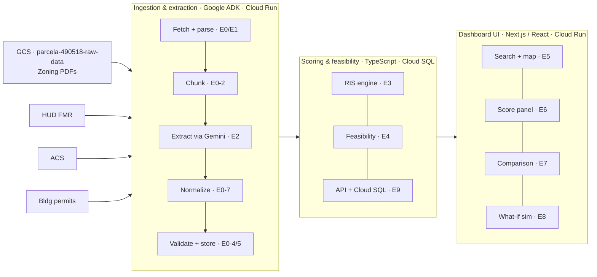

# Parcella — Architecture

## System Overview

## Layer Descriptions

### Data sources
Zoning ordinance PDFs are stored in GCS (`gs://parcela-490518-raw-data`) and fetched by the pipeline at runtime. Other public datasets (FMR, ACS, permits) are small CSVs downloaded via API. Infrastructure is managed with Terraform in `infra/`. See [`docs/DATA_SOURCES.md`](DATA_SOURCES.md) for download URLs, formats, and field mappings.

### Ingestion & extraction pipeline (E0/E1/E2)
A batch pre-processing pipeline in TypeScript deployed to Cloud Run. Runs once per jurisdiction before the demo via `npm run pipeline:run`. Implements the sequence: fetch PDF → parse text → chunk → extract fields via Gemini → normalize → validate → store.

**Key modules:**
- `lib/pipeline/runner.ts` — orchestrates the full sequence; injectable `PdfFetcher`, `PdfParser`, `FieldExtractor` interfaces
- `lib/pipeline/gcs-fetcher.ts` + `local-fetcher.ts` — GCS fetch (prod) or local `data/raw/` fallback (dev)
- `lib/pipeline/pdf-parser.ts` — PDF → text via `pdf-parse`
- `lib/pipeline/chunk.ts` — ≤4000 token overlapping chunks
- `lib/extractors/` — 8 Gemini extractors (one per field) using `@google-cloud/vertexai`; setbacks share one API call per chunk
- `lib/pipeline/gemini-concurrency.ts` — shared concurrency limiter (`p-limit`, capped at `GEMINI_CONCURRENCY`, default 5) and `withRetry` utility (exponential backoff on 429/RESOURCE_EXHAUSTED, up to `GEMINI_MAX_RETRIES`, default 3)
- `lib/pipeline/normalize.ts`, `validate.ts` — deterministic post-extraction conversion and plausibility checks

See [`docs/adr/0002-google-adk-for-pipeline-orchestration.md`](adr/0002-google-adk-for-pipeline-orchestration.md) for the original ADK decision rationale. The current implementation uses direct TypeScript orchestration; ADK integration is a post-MVP enhancement.

### Scoring & feasibility engine (E3/E4/E9)
Deterministic TypeScript calculations served via Next.js API routes, backed by Cloud SQL (PostgreSQL). Computes the composite Regulatory Impact Score (RIS) and feasibility outputs (unit yield, buildable area, cost per unit) from structured pipeline outputs.

**Implementation status (as of March 2026):**
- E3-5 composite formula (`RIS = 0.30×DCI + 0.25×DCOI + 0.20×PCI + 0.25×CRP`) and E3-6 DB storage: Done
- E3-1 DCI, E3-2 DCOI, E3-3 PCI sub-score calculations: Done — `lib/scoringEngine.ts`
- E3-4 CRP: Done — peer-set percentile in `lib/scoringEngine.ts`
- E4 feasibility modeling: Done — `lib/feasibility.ts` computes unit yield, parking footprint, cost per unit, and rent feasibility; `FeasibilityPanel` renders in UI; `feasibility_outputs` table seeded via `db/seeds/feasibilityOutputs.ts`

**RIS composite formula:** `RIS = 0.30×DCI + 0.25×DCOI + 0.20×PCI + 0.25×CRP`

| Sub-score | Weight | Rationale |
|-----------|--------|-----------|
| Density Constraint Index (DCI) | 30% | Density constraints (lot size, height, density limits) are the most direct regulatory barrier to housing supply — they set the hard ceiling on what can be built |
| Development Cost Impact (DCOI) | 25% | Cost impacts (parking minimums, regional construction costs) directly affect financial feasibility and are the most legible metric for policy makers |
| Comparative Restrictiveness Percentile (CRP) | 25% | Peer comparison provides the reference context that makes the score actionable — without it, an absolute score has no meaning |
| Permitting Complexity Indicator (PCI) | 20% | Permitting complexity matters but is partially captured by CRP and is harder to extract reliably from zoning text; weighted lower to reflect data confidence |

All sub-scores are normalized to 0–100 using min-max normalization against the peer jurisdiction set. Higher score = more restrictive regulatory environment.

### Dashboard UI (E5–E8)
Next.js / React frontend deployed to Cloud Run. Four functional areas: search + map, RIS score panel with inline AI disclosures, cross-jurisdiction comparison, and what-if policy simulation.

## Key Decisions

| Decision | Choice | Reference |
|----------|--------|-----------|
| Cloud platform | Google Cloud (Cloud Run, Cloud SQL, Vertex AI) | [ADR-0001](adr/0001-platform-and-stack.md) |
| Application stack | Next.js + TypeScript | [ADR-0001](adr/0001-platform-and-stack.md) |
| Pipeline orchestration | Direct TypeScript (ADK evaluated, deferred) | [ADR-0002](adr/0002-google-adk-for-pipeline-orchestration.md) |
| LLM | Gemini via Vertex AI | [ADR-0002](adr/0002-google-adk-for-pipeline-orchestration.md) |
| Pipeline execution | Batch pre-processing (not real-time) | [ADR-0002](adr/0002-google-adk-for-pipeline-orchestration.md) |
| Raw PDF storage | GCS (`parcela-490518-raw-data`) — files are ~90MB, too large for Git | `infra/` |
| Infrastructure as code | Terraform (`infra/`) — GCS bucket and IAM; Cloud Run deployed via CI/CD | `infra/` |
| Schema management | Drizzle ORM — `db/schema.ts` + `drizzle-kit` migrations | [ADR-0003](adr/0003-database-access-and-migrations.md) |
| Local dev database | Docker Compose (`postgres:16`) — no GCP credentials required | [ADR-0003](adr/0003-database-access-and-migrations.md) |
| Migration timing | Auto-apply on deploy before app starts | [ADR-0003](adr/0003-database-access-and-migrations.md) |
